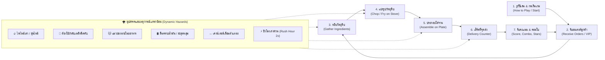

# 🍳 CaDaCook - Game Details & Design Specifications

เอกสารฉบับนี้รวบรวมรายละเอียดการออกแบบเกมเพลย์, เนื้อเรื่องและปูมหลังของเกม, การออกแบบองค์ประกอบต่างๆ, ระบบตรรกะและการทำงาน (Game Logic), ตลอดจนองค์ประกอบพิเศษและระบบเสียงทั้งหมดของเกม **CaDaCook (CaDaCooked)** พัฒนาบนเอนจิน **Unity 6 (6000.3.6f1)** ด้วยภาษา **C#** ภายใต้สถาปัตยกรรมกราฟิก **Universal Render Pipeline (URP)**

---

## 📑 สารบัญ (Table of Contents)

1. [🎮 1. การออกแบบตัวเกม (Game Design Overview)](#-1-การออกแบบตัวเกม-game-design-overview)
2. [📖 2. เนื้อเรื่องและปูมหลังของเกม (Story & Narrative)](#-2-เนื้อเรื่องและปูมหลังของเกม-story--narrative)
3. [🎨 3. การออกแบบองค์ประกอบในเกม (Game Elements Design)](#-3-การออกแบบองค์ประกอบในเกม-game-elements-design)
4. [⚙️ 4. ตรรกะและระบบการทำงานภายในเกม (Game Logic & System Mechanics)](#️-4-ตรรกะและระบบการทำงานภายในเกม-game-logic--system-mechanics)
5. [✨ 5. องค์ประกอบพิเศษและจุดเด่นที่แตกต่างจากเกมทั่วไป (Special & Unique Features)](#-5-องค์ประกอบพิเศษและจุดเด่นที่แตกต่างจากเกมทั่วไป-special--unique-features)

---

## 🎮 1. การออกแบบตัวเกม (Game Design Overview)

### 1.1 แนวเกมและกลุ่มเป้าหมาย (Genre & Target Audience)
- **แนวเกม (Genre):** 3D Fast-paced Casual Cooking Simulation / Action Kitchen Management
- **ธีมหลัก (Theme):** ห้องครัวแฟนตาซีหลากสภาพแวดล้อมที่เต็มไปด้วยความโกลาหล สนุกสนาน ตื่นเต้น และมีชีวิตชีวา (Casual Chaos & Fast-paced Fun)
- **กลุ่มเป้าหมาย (Target Audience):** ผู้เล่นทุกเพศทุกวัยที่ชื่นชอบเกมแนวทำอาหาร บริหารเวลา (Time Management) และเกมที่มีความท้าทายแบบไดนามิก (สไตล์ *Overcooked* / *Kitchen Chaos*)

### 1.2 ปรัชญาการออกแบบเกม (Core Design Principles)
1. **Clear & Immediate Visual/Audio Feedback:** ทุกการกระทำของผู้เล่น ไม่ว่าจะเป็นการหยิบวัตถุดิบ, หั่น, วางบนเตา, ทอด, จัดจาน, เสิร์ฟ, ฉีดถังดับเพลิง หรือการลื่นไถล จะมีเอฟเฟกต์ภาพและเสียงตอบสนองทันทีแบบเรียลไทม์
2. **Decoupled Event-Driven Architecture:** ระบบ Game Logic แยกขาดจาก Presentation (Visual, Animation, Audio, UI) 100% โดยเชื่อมต่อกันผ่าน **C# Events (`event EventHandler`)** เพื่อความยืดหยุ่นและการดูแลรักษาที่ง่าย
3. **Emergent Gameplay & Dynamic Chaos:** เพิ่มความสนุกและความตื่นเต้นด้วยเหตุการณ์ไม่คาดฝัน (ไฟไหม้เตา, แมวขโมยของ, พื้นลื่นคราบน้ำมัน, หลุมดักสะดุด, เคาน์เตอร์เลื่อน 2 แกน, ชั่วโมงเร่งด่วน) ที่บังคับให้ผู้เล่นต้องปรับตัวตลอดเวลา
4. **Data-Driven Scalability:** กำหนดข้อมูลวัตถุดิบ สูตรอาหาร และเวลาในการปรุงทั้งหมดผ่าน **`ScriptableObject`** ทำให้ทีมงานสามารถเพิ่มเมนูและปรับสมดุลเกมผ่าน Unity Inspector ได้ทันทีโดยไม่ต้องแก้ไขโค้ดโปรแกรม

### 1.3 ลูปการเล่นหลัก (Core Gameplay Loop)



1. **เริ่มต้นรอบเล่น (Start & Tutorial):** หน้าจอ How to Play แสดงปุ่มควบคุม กฎการทำอาหาร และป้ายเตือนระวังแมวขโมยถังดับเพลิง ผู้เล่นสามารถกดปุ่มใดๆ (Press Any Button) เพื่อเข้าสู่เกมได้ทันที
2. **รับออเดอร์ (Receive Orders):** ระบบ `DeliveryManager` สุ่มรายการอาหารเข้ามาในคิวสูงสุด 4 รายการ (รวมถึงมีโอกาสสุ่มได้ออเดอร์พิเศษ **VIP Critic** การ์ดทองคะแนน 3 เท่า)
3. **หยิบวัตถุดิบ (Gather Ingredients):** เดินไปหยิบวัตถุดิบจาก `ContainerCounter` เช่น ขนมปังเบอร์เกอร์, ชิ้นเนื้อดิบ, ผักกาดหอม, มะเขือเทศ, ชีส
4. **แปรรูปวัตถุดิบ (Process Ingredients):**
   - นำผัก/ชีสไปหั่นบน `CuttingCounter` โดยกดปุ่ม `[F]` ซ้ำๆ จนหลอด Progress เต็ม
   - นำเนื้อดิบไปทอดบน `StoveCounter` รอจนสุก (Fried) ภายในเวลาที่กำหนด **หากปล่อยทิ้งไว้เกิน 3 วินาที เนื้อจะไหม้ (Burned) และเตาจะติดไฟลุกไหม้**
5. **จัดวางลงจาน (Assemble on Plate):** หยิบจานจาก `PlatesCounter` แล้วนำมารวมวัตถุดิบที่แปรรูปเสร็จแล้วเข้าด้วยกัน
6. **ส่งมอบอาหาร (Deliver Order):** นำจานไปส่งที่ `DeliveryCounter` เพื่อตรวจเช็คความถูกต้องของสูตร
7. **คำนวณคะแนนและตัดเกรด (Score, Combo & 3-Star Rating):** รับแต้มสะสม, ตัวคูณ Tip & Combo Streak (1.5x -> 2.0x), และเมื่อหมดเวลาระบบจะแสดง Dashboard สรุปผลดาว 1-3 ดาว พร้อมพาผู้เล่นกลับสู่หน้าเมนูหลักอัตโนมัติใน 10 วินาที

### 1.4 ระบบควบคุม (Controls & Input Mapping)

ระบบขับเคลื่อนด้วย **Unity New Input System (`com.unity.inputsystem`)** รองรับทั้งคีย์บอร์ด เมาส์ และคอนโทรลเลอร์ (Gamepad):

| คำสั่ง (Action) | คีย์บอร์ด / เมาส์ (Keyboard & Mouse) | จอยเกม (Gamepad / Controller) | คำอธิบายฟังก์ชัน |
| :--- | :--- | :--- | :--- |
| **Move** | `[W] [A] [S] [D]` หรือ `Arrow Keys` | `Left Stick` (อนาล็อกซ้าย) | เคลื่อนที่ตัวละครเชฟ 3 มิติ และหมุนหน้าตามทิศทาง |
| **Interact** | `[E]` หรือ `Spacebar` | `Button South` (`A` บน Xbox / `✕` บน PS) | หยิบ/วาง วัตถุดิบ, หยิบจาน, หยิบถังดับเพลิง, ทิ้งถังดับเพลิงลงพื้น |
| **Interact Alternate** | `[F]` | `Button West` (`X` บน Xbox / `□` บน PS) | หั่นวัตถุดิบบนเขียง / กดค้างเพื่อพ่นละอองขาวดับเพลิง |
| **Pause Game** | `[Escape]` | `Start / Menu Button` | หยุดเกมชั่วคราว / เปิดเมนู Pause |
| **Start Immediately** | `Any Key / Mouse Click` | `Any Gamepad Button` | ข้ามหน้า How to Play และเริ่มจับเวลาเล่นเกมทันที |

---

## 📖 2. เนื้อเรื่องและปูมหลังของเกม (Story & Narrative)

### 2.1 วิกฤตครัวด่วน! ภารกิจเสิร์ฟมื้อสำคัญแด่ท่านนายกรัฐมนตรี (The Prime Minister's Banquet Emergency)

เรื่องราวเริ่มต้นขึ้นเมื่อผู้เล่นได้รับบทเป็น **"หัวหน้าเชฟมือทอง"** ผู้ได้รับเกียรติสูงสุดในการได้รับเลือกให้เป็นผู้รับผิดชอบปรุงอาหารสำหรับงานเลี้ยงต้อนรับระดับชาติของ **"ท่านนายกรัฐมนตรี"** ซึ่งเป็นงานสำคัญระดับประเทศที่มีแขกผู้มีเกียรติมากมายมาร่วมงาน

ทว่าในระหว่างการเดินทาง ขบวนรถครัวเคลื่อนที่กลับประสบอุบัติเหตุไม่คาดฝัน ทำให้เกิด **"เหตุน้ำมันรั่วไหล (Oil Leak Accident)"** เจิ่งนองเต็มพื้นบริเวณครัวชั่วคราว และด้วยเวลาที่งานเลี้ยงของท่านนายกฯ กำลังจะเริ่มต้นขึ้นในอีกไม่กี่นาทีข้างหน้า เชฟไม่สามารถยกเลิกงานหรือรอรถช่วยเหลือได้ จึงต้องตัดสินใจเปิดครัวฉุกเฉิน ณ จุดเกิดเหตุทันที!

ผู้เล่นจึงต้องเร่งรีบปรุงอาหารตามรายการ **ORDER** ของงานเลี้ยงให้ถูกต้อง รวดเร็ว และนำจานที่จัดเสร็จไปส่งที่จุดส่งอาหาร (`DeliveryCounter`) เพื่อฝากให้ทีมงานนำส่ง (Delivery Runner) รีบวิ่งนำอาหารไปเสิร์ฟยังโต๊ะจัดเลี้ยงของท่านนายกรัฐมนตรีให้ทันเวลาอย่างเฉียดฉิวทุกวินาที

### 2.2 ปูมหลังตัวละครและคู่ปรับตัวป่วน (Characters & Rivals)

```text
       ┌────────────────────────────────────────────────────────┐
       │             👨‍🍳 หัวหน้าเชฟ (The Executive Chef)          │
       │ ผู้รับภารกิจปรุงอาหารด่วนฉุกเฉินส่งงานเลี้ยงท่านนายกรัฐมนตรี │
       └───────────────────────────┬────────────────────────────┘
                                   │
                    เผชิญหน้ากับอุปสรรคและตัวป่วน
                                   │
                   ┌───────────────┴───────────────┐
                   ▼                               ▼
       ┌───────────────────────┐       ┌───────────────────────┐
       │ 🐱 เจ้าส้ม (Stray 01)  │       │ 🐱 เจ้าควัน (Stray 02)│
       │ แมวไร้บ้านจอมฉกเนื้อสุก │       │ แมวไร้บ้านจอมขโมยถังดับ│
       └───────────────────────┘       └───────────────────────┘
```

1. **👨‍🍳 เชฟใหญ่ผู้กู้วิกฤต (The Executive Chef) — ตัวละครผู้เล่น:**
   - **บทบาท:** ยอดเชฟผู้มีความมุ่งมั่นและสมาธิเป็นเลิศ ต้องควบคุมสถานการณ์ในครัวฉุกเฉิน ทำอาหารแข่งกับเวลาที่นับถอยหลัง และส่งมอบอาหารให้คนส่งของนำไปเสิร์ฟในงานนายกฯ ได้ทันท่วงที
   - **เป้าหมาย:** ปรุงอาหารตามสั่งให้ครบทุกจาน ทำคะแนนคอมโบ และรักษามาตรฐานความอร่อยระดับ Master Chef แม้อยู่ในภาวะวิกฤต

2. **🐱 เจ้าส้ม & เจ้าควัน — สองแมวไร้บ้านจอมป่วน (The Two Stray Cats):**
   - **บทบาท:** สองแมวจรจัดไร้บ้านที่อาศัยอยู่ใกล้จุดเกิดเหตุ เมื่อพวกมันได้กลิ่นหอมหวลของเนื้อย่างและขนมปังสดใหม่ จึงแอบย่องเข้ามาในครัวชั่วคราวเพื่อหาอาหารประทังชีวิต
   - **พฤติกรรม:** พวกมันจะคอยเล็งจังหวะที่เชฟเผลอ ย่องเข้ามาคาบเนื้อสุก ผักสด หรือแม้กระทั่งแอบคาบถังดับเพลิงไปซ่อน! เมื่อขโมยของได้จะใส่เกียร์หมาวิ่งหนีสุดฝีเท้า เชฟจึงต้องคอยเดินเข้าไปส่งเสียงไล่ให้พวกมันตกใจหนีไป

3. **🎩 ผู้แทนส่งอาหารและแขก VIP (Delivery Runners & VIP Guests):**
   - **บทบาท:** ทีมงานส่งอาหารที่คอยรับจานจากเคาน์เตอร์ส่ง (`DeliveryCounter`) ไปยังงานเลี้ยงของนายกฯ และมีบางช่วงเวลาที่ท่านนายกฯ หรือแขก VIP ส่งออเดอร์เร่งด่วนพิเศษ (การ์ดทอง 3X) ที่ต้องการอาหารภายใน 25 วินาที

4. **🌪️ สภาพแวดล้อมและเครื่องมือที่ไม่อำนวย (Harsh Unprepared Environment):**
   - อุบัติเหตุน้ำมันรั่วทำให้เกิดคราบน้ำมันบนพื้น 4 จุด (`SlipperyFloor`) เชฟจะลื่นไถลและหมุนตัวเคว้งหากเดินเหยียบ
   - อุปกรณ์ครัวฉุกเฉินที่มีความร้อนสูงทำให้เนื้อไหม้เร็วและเกิดไฟลุกไหม้ได้ง่าย (`FireHazard`) บังคับให้ต้องใช้ถังดับเพลิงฉีดโฟมขาวดับไฟ
   - พื้นผิวที่ไม่มั่นคงทำให้เคาน์เตอร์เลื่อนตำแหน่งไปมา และเกิดหลุมดักสะดุดตามทางเดิน

---

## 🎨 3. การออกแบบองค์ประกอบในเกม (Game Elements Design)

### 3.1 ตัวละครและแอนิเมชัน (Characters & Animation)
- **ตัวละครเชฟ (Player):**
  - โมเดล 3D สไตล์น่ารัก อบอุ่น มีชีวิตชีวา
  - ระบบแอนิเมชัน: `IsWalking` (เดิน/วิ่ง), ท่าทางหยิบถือวัตถุดิบเหนือศีรษะ, ท่าทางถือถังดับเพลิงพร้อมฉีด, ท่าทางลื่นไถลหมุนตัว 360 องศาเมื่อเหยียบคราบน้ำมัน
  - ระบบ Particle ละอองเหงื่อ/ควันเวลาวิ่งสปีด
- **แมวป่วนครัว 3D (Neko Cat NPCs):**
  - ใช้โมเดล 3D คุณภาพสูง 2 สายพันธุ์ (Neko Cat 01 แมวส้มลายเสือ, Neko Cat 02 แมวเทาขนสั้น) สเกลตัวเล็กน่ารัก (`scale = 0.35f`)
  - **Procedural Bouncy Locomotion (`CatProceduralAnimator.cs`):** ระบบแอนิเมชันคำนวณแบบเรียลไทม์ หางส่ายดุ๊กดิ๊กไปมา ลำตัวโยกขึ้นลงตามจังหวะก้าวเดิน และมีจุดคาบอาหาร `HoldPoint` ที่ปากแมว

### 3.2 ฉากและสภาพแวดล้อม (Kitchen Stages & Environments)
1. **🏠 ฉากที่ 1: ห้องครัวมาตรฐาน (Cozy Indoor Kitchen):**
   - บรรยากาศห้องครัวโมเดิร์น โทนสีอบอุ่น พื้นกระเบื้องลายไม้ เคาน์เตอร์หินอ่อน มีหน้าต่างมองเห็นวิวทิวทัศน์
   - เป็นด่านเริ่มต้นที่เน้นการเรียนรู้ระบบเคาน์เตอร์, การทำอาหารพื้นฐาน, และการรับมือกับไฟไหม้และคราบน้ำมัน
2. **🏖️ ฉากที่ 2: ครัวแพลอยน้ำริมหาด (Beach Raft Kitchen):**
   - ครัวที่ตั้งอยู่บนแพไม้ลอยน้ำกลางทะเล มีฉากหลังเป็นต้นมะพร้าว ทรายขาว และน้ำทะเลใส
   - **ระบบคลื่นแพโยก (`RaftKitchenTilt.cs`):** ตัวแพจะเอียงตามแรงระลอกคลื่นแบบ Sine Wave อย่างนุ่มนวล สร้างมิติทางฟิสิกส์และความสมจริง

### 3.3 รายการเคาน์เตอร์ทำอาหารทั้ง 7 ชนิด (Modular Kitchen Counters)

```text
┌─────────────────┬────────────────────────────────────────────────────────────────────────┐
│ เคาน์เตอร์      │ หน้าที่และความรับผิดชอบ (Role & Description)                           │
├─────────────────┼────────────────────────────────────────────────────────────────────────┤
│ ClearCounter    │ เคาน์เตอร์ว่างอเนกประสงค์ สำหรับวางพักวัตถุดิบ หรือนำจานมารวมวัตถุดิบ  │
│ ContainerCounter│ ตู้หยิบวัตถุดิบสดใหม่ไม่จำกัดจำนวน (ขนมปัง, เนื้อดิบ, ผัก, มะเขือเทศ, ชีส)│
│ CuttingCounter  │ เขียงหั่นผัก/เนื้อ/ชีส กด [F] เพื่อสะสมหลอด Progress จนกลายเป็นชิ้นหั่น│
│ StoveCounter    │ กระทะทอดเนื้อดิบ ควบคุมด้วย FSM 4 สเตต (Idle, Frying, Fried, Burned)   │
│ PlatesCounter   │ เคาน์เตอร์ผลิตจานเปล่าอัตโนมัติทีละใบ รองรับการวางซ้อนสูงสุด 4 ใบ     │
│ DeliveryCounter │ เคาน์เตอร์ส่งมอบอาหาร ตรวจสอบสูตรกับ DeliveryManager และให้คะแนน       │
│ TrashCounter    │ ถังขยะสำหรับทำลายวัตถุดิบที่ไหม้หรือทำผิดพลาดทิ้งทันที                 │
└─────────────────┴────────────────────────────────────────────────────────────────────────┘
```

### 3.4 วัตถุดิบและลำดับขั้นของสูตรอาหาร (Data-Driven Recipes)

```text
[ วัตถุดิบดิบ (Raw) ]       ──(แปรรูป)──►      [ วัตถุดิบพร้อมเสิร์ฟ (Processed) ]
• ขนมปัง (Burger Bun)      ─────────────►    Burger Bun (พร้อมประกอบ)
• เนื้อดิบ (Meat Patty)     ──(เตาทอด 4s)──►   Meat Patty Cooked (เนื้อสุก)
• ผักกาดหอม (Cabbage)      ──(เขียงหั่น 5 ครั้ง)──► Cabbage Slices (ผักหั่น)
• มะเขือเทศ (Tomato)       ──(เขียงหั่น 3 ครั้ง)──► Tomato Slices (มะเขือเทศหั่น)
• ก้อนชีส (Cheese Block)   ──(เขียงหั่น 3 ครั้ง)──► Cheese Slices (ชีสแผ่น)

[ เมนูอาหารสำเร็จรูป (Completed Dishes on Plate) ]
1. 🍔 Simple Burger: ขนมปัง + เนื้อสุก
2. 🥗 Salad Burger: ขนมปัง + เนื้อสุก + ผักกาดหั่น
3. 🍅 Mega Deluxe Burger: ขนมปัง + เนื้อสุก + ผักกาดหั่น + มะเขือเทศหั่น
4. 🧀 Cheese Burger: ขนมปัง + เนื้อสุก + ชีสแผ่น
```

---

## ⚙️ 4. ตรรกะและระบบการทำงานภายในเกม (Game Logic & System Mechanics)

### 4.1 ระบบ Finite State Machine (FSM)

เกม CaDaCook ใช้ FSM ควบคุมตรรกะใน 3 ระบบหลัก:

#### 1. KitchenGameManager FSM (ลูปสถานะเกม)
```text
[ WaitingToStart ] ──► [ CountdownToStart ] ──► [ GamePlaying ] ──► [ GameOver ]
 (รอโหลดฉากเสร็จ)       (หน้าต่าง How to Play      (เล่นเกมจับเวลา     (แสดง Dashboard
                         กดปุ่มใดๆ ข้ามได้ทันที)      150 วินาที)        สรุปผล 10 วินาที)
```

#### 2. StoveCounter FSM (การทอดเนื้อและไฟไหม้)
```text
                 วางเนื้อดิบ MeatPatty
  [ IDLE ] ─────────────────────────────────► [ FRYING ]
                                                 │
                                                 │ fryingTimer >= 4.0s (หลอดเหลืองเต็ม)
                                                 ▼
  [ BURNED ] ◄────────────────────────────── [ FRIED ]
  (เตาติดไฟลุกไหม้)  burningTimer >= 3.0s (เนื้อสุกพร้อมหยิบขึ้นจาน)
```

#### 3. KitchenCatNPC FSM (พฤติกรรม AI แมวป่วนครัว)
```text
  [ Roaming ] ──(พบอาหารบนเคาน์เตอร์)──► [ Targeting ] ──► [ Stealing ] ──► [ Fleeing ]
  (เดินสำรวจ)                           (เดินตรงไปหา)       (คาบอาหาร)       (วิ่งสปีดหนี 9.5m/s)
      ▲                                                                         │
      └──────────────────────── (หนีพ้นระยะกล้อง 13m) ──────────────────────────┘
```

### 4.2 อัลกอริทึมการตรวจสอบสูตรอาหาร (Data-Driven Recipe Matching)
- บนจาน (`PlateKitchenObject`) มีรายการ `List<KitchenObjectSO>` เก็บวัตถุดิบที่รวมอยู่
- เมื่อผู้เล่นนำจานไปวางที่ `DeliveryCounter` ระบบจะนำรายการวัตถุดิบบนจานไปเปรียบเทียบกับสูตรอาหารในคิวออเดอร์ (`waitingRecipeSOList`)
- **Set-Based Matching:** การตรวจสอบใช้หลักการจับคู่แบบไม่สนใจลำดับการวาง (Order-Independent) เช่น วางผักก่อนเนื้อ หรือวางเนื้อก่อนผัก จะถือว่าถูกต้องเหมือนกัน 100%

### 4.3 ระบบคะแนน คอมโบ และการตัดเกรดดาว (Scoring, Combo & 3-Star Rating)
1. **คะแนนพื้นฐาน (Base Points):** ส่งอาหารสำเร็จได้รับ 100 แต้มต่อจาน
2. **โบนัส VIP Critic (VIP Orders):** การ์ดออเดอร์สีทอง มีเวลานับถอยหลัง 25 วินาที หากส่งทันจะได้คะแนน **3 เท่า (300 แต้ม)** และได้โบนัสเวลาเล่นเพิ่ม **+12 วินาที**
3. **Tip & Combo Streak System:**
   - ส่งอาหารสำเร็จต่อเนื่องโดยไม่หมดเวลา จะเริ่มนับคอมโบ
   - คอมโบระดับ 1: ตัวคูณ `1.5x` (ข้อความสีส้มลอยข้างนาฬิกา)
   - คอมโบระดับ 2 ขึ้นไป: ตัวคูณ `2.0x` (Super Combo!)
   - หากปล่อยให้ออเดอร์หลุดเวลา คอมโบจะถูกรีเซ็ตกลับเป็น 0
4. **ระบบตัดเกรด 3-Star Rating Dashboard:**
   - ⭐ **1 Star (Bronze - Line Cook):** คะแนน 0 - 399 แต้ม
   - ⭐⭐ **2 Stars (Silver - Head Chef):** คะแนน 400 - 799 แต้ม
   - ⭐⭐⭐ **3 Stars (Gold - Master Chef):** คะแนน 800 แต้มขึ้นไป

---

## ✨ 5. องค์ประกอบพิเศษและจุดเด่นที่แตกต่างจากเกมทั่วไป (Special & Unique Features)

### 5.1 ระบบอุปสรรคและภัยพิบัติไดนามิก (Dynamic Hazard System)

```text
┌────────────────────────────────────────────────────────────────────────────────────────┐
│                        🌪️ Dynamic Hazard & Obstacle Systems                           │
├─────────────────────────┬────────────────────────────┬─────────────────────────────────┤
│ ระบบอุปสรรค (Hazard)    │ ผลกระทบต่อผู้เล่น (Impact) │ วิธีการแก้ไข / รับมือ (Solution)│
├─────────────────────────┼────────────────────────────┼─────────────────────────────────┤
│ 🔥 เตาไฟไหม้ & สุ่มไฟไหม้│ เตา/เคาน์เตอร์พ่นไฟดำ      │ หยิบถังดับเพลิง 3D กด [F] ค้าง  │
│ (FireHazard)            │ หยิบจับอาหารไม่ได้         │ พ่นละอองขาวดับไฟให้สนิท         │
├─────────────────────────┼────────────────────────────┼─────────────────────────────────┤
│ 🛢️ คราบน้ำมันพื้นลื่น   │ ตัวละครไถลไปข้างหน้า       │ เดินเลี่ยงคราบน้ำมัน 4 จุด      │
│ (SlipperyFloor)         │ พร้อมหมุนตัวเคว้ง 360°/s   │ หรือกะจังหวะแรงเฉื่อยให้แม่นยำ  │
├─────────────────────────┼────────────────────────────┼─────────────────────────────────┤
│ 🕳️ หลุมดักสะดุด          │ ตัวละครเดินช้าลง 50%       │ หลบหลีกหลุมตามทางเดิน           │
│ (PotholeTrap)           │ มีโอกาสทำของในมือหลุด      │                                 │
├─────────────────────────┼────────────────────────────┼─────────────────────────────────┤
│ ↔️ เคาน์เตอร์เลื่อนคู่    │ เคาน์เตอร์เลื่อนแกน X และ Z│ วางของและเดินไปหยิบของตามจังหวะ │
│ (Dual Moving Counters)  │ เปลี่ยนตำแหน่งตลอดเวลา     │ การเคลื่อนที่ของเคาน์เตอร์      │
├─────────────────────────┼────────────────────────────┼─────────────────────────────────┤
│ 🐱 แมวป่วนขโมยของ       │ แมวย่องมาคาบเนื้อ/ผัก/ถัง  │ เดินเข้าไปใกล้เพื่อส่งเสียงไล่  │
│ (KitchenCatNPC)         │ ไปซ่อนนอกฉาก               │ ให้แมวตกใจวิ่งหนี               │
├─────────────────────────┼────────────────────────────┼─────────────────────────────────┤
│ ⚡ ชั่วโมงเร่งด่วน       │ ออเดอร์เข้าถี่ขึ้น 2 เท่า   │ เร่งมือทำอาหาร ทำคะแนนคูณ 2 เท่า│
│ (Rush Hour 2x)          │ ในช่วงกลางเกม              │ เพื่อเก็บแต้มสูงสุด             │
└─────────────────────────┴────────────────────────────┴─────────────────────────────────┘
```

### 5.2 ถังดับเพลิง 3D Interactive (Enhanced 3D Fire Extinguisher)
- **โมเดล 3D สมบูรณ์แบบ:** ตัวถังสีแดงเงา (`Red Body`), หัวฉีดสีเทาเงิน (`Top Nozzle`), ปลายท่อสีดำ (`Nozzle Tip`) พร้อมระบบ Safe Material ป้องกัน Texture หายใน Standalone Builds
- **ป้ายบอกปุ่มกด World Space Billboard:**
  - เมื่อวางอยู่บนพื้น: แสดงป้ายลอยตัวใหญ่เด่นชัด `[ E ] PICK UP` พร้อมแอนิเมชันลอยขึ้นลง (Bobbing)
  - เมื่อถืออยู่ในมือ: แสดงป้าย `[ F ] HOLD TO SPRAY` และ `[ E ] DROP`
- **ระบบฉีดพ่นละอองจริง (Forward Mist Spray):**
  - กดปุ่ม `[F]` ค้างเพื่อพ่นละอองโฟมสีขาวใส่เปลวไฟตรงหน้า (องศาพ่นหันตามทิศทางหน้าของตัวละครแบบเรียลไทม์)
  - ดับไฟได้อย่างรวดเร็วในเวลาประมาณ 0.55 วินาที
  - กดปุ่ม `[E]` เพื่อทิ้งถังดับเพลิงลงบนพื้นได้อย่างอิสระ (ห้ามวางบนเคาน์เตอร์เพราะแมวจะแอบมาขโมย!)

### 5.3 ระบบเสียงรอบทิศทางและเสียงประกอบแบบไดนามิก (Spatial Audio & SFX)
ขับเคลื่อนผ่าน `SoundManager.cs` และ `PlayerSounds.cs` โดยเล่นเสียงผ่านตำแหน่ง 3D ในโลกของเกม:
- 🔪 **เสียงหั่นอาหาร (Chop SFX):** เสียงสับมีดกระทบเขียงไม้เป็นจังหวะตามการกดปุ่ม
- 🍳 **เสียงเตาทอด (Sizzling SFX):** เสียงน้ำมันเดือดฉ่าเมื่อวางเนื้อดิบลงบนกระทะ
- 🚨 **เสียงสัญญาณเตือนภัย (Warning & Fire Alarm SFX):** เสียงติ๊ดเตือนเมื่อเนื้อใกล้ไหม้ และเสียงหวอเตือนภัยเมื่อเกิดไฟลุกไหม้
- 💨 **เสียงพ่นละอองดับเพลิง (Extinguisher Spray SFX):** เสียงฟู่ของก๊าซโฟมแรงดันสูงขณะฉีดดับไฟ
- 🔔 **เสียงกระดิ่งส่งอาหารสำเร็จ (Delivery Success SFX):** เสียงดนตรีแห่งความสำเร็จเมื่อเสิร์ฟอาหารตรงสูตร
- ❌ **เสียงเตือนส่งอาหารผิด (Delivery Fail SFX):** เสียงเตือนเมื่อส่งอาหารผิดสูตรหรือไม่ทันเวลา
- 🐱 **เสียงร้องเหมียว (Cat Meow & Scared SFX):** เสียงแมวร้องตอนย่องเข้ามา และเสียงร้องตกใจตอนวิ่งหนี
- 👣 **เสียงฝีเท้า (Footstep SFX):** เสียงก้าวเท้ากระทบพื้นตามจังหวะการเดินของเชฟ

### 5.4 การปรับแต่งประสิทธิภาพและความเข้ากันได้ทางเทคนิค (Technical Innovations)
1. **Zero Garbage Collection in `Update()`:** ปราศจากการใช้คำสั่ง `new` ในฟังก์ชันลูปทุกเฟรม แคชหน่วยความจำและตัวแปรทั้งหมดตั้งแต่ `Awake()`
2. **Safe Event Invocations:** ทุก C# Event เรียกใช้ผ่าน `?.Invoke()` ป้องกัน NullReferenceException 100%
3. **Pure ASCII & Localization Polish:** ข้อความ UI และป้ายเตือนทั้งหมดผ่านการจัดรูปแบบให้คมชัด ไม่เกิดปัญหากล่องสี่เหลี่ยม `□` จาก Missing Glyph ในทุกระบบปฏิบัติการ
4. **Balanced 16:9 Canvas Scaler:** ตั้งค่าหน้าจอเป็น Full HD 1920x1080 พร้อม `MatchWidthOrHeight = 0.5` ทำให้ UI แสดงผลสมส่วน ไม่บวมหรือยืดในทุกความละเอียดหน้าจอ

---

## 🏁 สรุปภาพรวมโปรเจกต์ (Project Summary)

เกม **CaDaCook** ได้ผสมผสานระหว่าง **ความสนุกสนานของเกมเพลย์ทำอาหารที่ควบคุมง่าย เข้ากับความท้าทายจากระบบอุปสรรคและเหตุการณ์ไม่คาดฝัน** ภายใต้โครงสร้างสถาปัตยกรรมโค้ดที่สะอาด เป็นระเบียบ ยืดหยุ่น และมีประสิทธิภาพสูงตามมาตรฐานสากลของ Senior Software Engineer พร้อมรองรับการต่อยอดเป็นเกมเต็มรูปแบบหรือนำไปใช้เป็นผลงานอ้างอิงทางวิชาการและวิจัยได้อย่างสมบูรณ์แบบ
