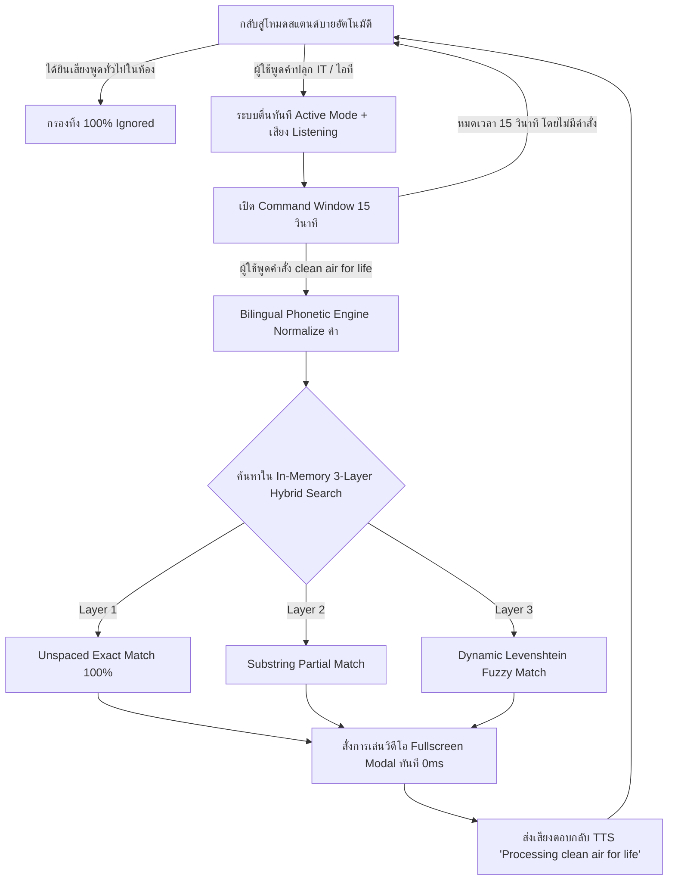

# Voice Command & Action Trigger System (ระบบตรวจจับคำสั่งด้วยเสียง PMITPBRU)

> **วัตถุประสงค์ของเอกสารนี้:** เอกสารนี้ระบุรายละเอียดโปรเจกต์ สถาปัตยกรรม ฐานข้อมูล และข้อกำหนดของระบบอย่างสมบูรณ์ เพื่อให้นักพัฒนาและ AI ทำงานร่วมกันได้อย่างแม่นยำ

---

## 1. ข้อมูลภาพรวมของโปรเจกต์ (Project Overview)

ระบบตรวจจับคำสั่งด้วยเสียงอัจฉริยะ (Voice-Activated Action & Trigger System) ที่ทำงานบนเว็บเบราว์เซอร์ 
ระบบใช้สถาปัตยกรรม **2-Stage Passive Standby & Wake-Word Architecture** โดยเริ่มต้นในโหมดสแตนด์บาย (จำศีล) คอยดักฟัง **"คำปลุก / รหัสผ่านเสียง" (Wake-Word: `"IT"` / `"ไอที"`)** เมื่อได้ยินระบบจะขานรับว่า **`"Listening"`** และเข้าสู่โหมดตื่นรับคำสั่ง (Active Command Window 15 วินาที) เพื่อรอรับ **"คำสั่งเสียง" (Voice Command: `"clean air for life"`)** ทั้งภาษาไทยและภาษาอังกฤษ 

ระบบจะประมวลผลผ่าน **Bilingual Thai-English Phonetic Engine** พร้อมระบบจับคู่ 3 ชั้น (Multi-Layer Hybrid Search) พูดตอบกลับด้วยเสียงสังเคราะห์ว่า **`"Processing clean air for life"`** (Text-to-Speech) และดำเนินการสั่งการ (Action Triggers) ทันที 0ms Latency เช่น:
1. **การเล่นวิดีโอ (Video Actions):** แสดงผลวิดีโอ YouTube หรือไฟล์วิดีโอที่อัปโหลดใน Pop-up Modal / Fullscreen
2. **การเปิดเว็บไซต์ (URL Actions):** แสดงผลใน Modal / Iframe ภายในหน้าเดิม หรือเปิด Tab ใหม่
3. **การจัดการหลังบ้าน (Admin Control Panel):** ระบบบริหารจัดการคำสั่งเสียง ลิงก์ และวิดีโอ (CRUD) พร้อมระบบอัปโหลดไฟล์วิดีโอ (.mp4, .webm, .ogg)

---

## 2. เทคโนโลยีที่ใช้ (Tech Stack & Architecture)

### **Frontend**
- **Core Language:** HTML5 (Semantic & Accessible), Modern JavaScript (ES6+ Vanilla)
- **Styling:** Modern Vanilla CSS
  - **Theme:** Clean Light Minimalist (พื้นหลังสีขาวคลีนอมเขียว-ฟ้า เรียบหรู สบายตา)
  - **Color Ratio System:**
    - 💚 **เขียวมรกต Primary (50%):** `#059669` / `#10b981` (แบรนด์ `PM`, โหมด Active Listening, ปุ่มหลัก, สเปกตรัมส่วนแรก 50%, ไทม์เมอร์)
    - 💙 **ฟ้าคายาน Secondary (40%):** `#0284c7` / `#06b6d4` (แบรนด์ `ITPBRU`, โหมด Standby, ขอบการ์ด, Badges, สเปกตรัมส่วนหลัง 40%)
    - 🎯 **ปุ่มปฏิกิริยา Interactive Palette (10%):** ส้ม (`#ea580c`), แดง (`#dc2626` / โหมด Muted), ฟ้าอ่อน (`#0284c7`), ดำเทาสเลท (`#1e293b`)
  - **Header & Navigation:** 
    - พื้นหลังโปร่งใส (`background: transparent`), แสดงเฉพาะโลโก้ชื่อโปรเจกต์และปุ่ม Hamburger
    - กรอบ Dropdown แนบติดใต้ปุ่ม Hamburger (`top: calc(100% + 2px)`), ขอบมน **`border-radius: 5px;`**
    - บน Desktop PC & Laptop รองรับระบบ **Hover to Reveal** (สไลด์เปิดอัตโนมัติเมื่อชี้เมาส์ส่วนบน)
- **Audio DSP & Noise Gate Pipeline:**
  - `Web Audio API (AudioContext & BiquadFilter)`:
    - **Hardware Audio Constraints (48 kHz):** บังคับใช้ Echo Cancellation, Noise Suppression และ Auto Gain Control ระดับฮาร์ดแวร์
    - **Highpass Filter (90 Hz):** ตัดเสียงครางความถี่ต่ำ (เสียงแอร์, เสียงพัดลมคอมพิวเตอร์)
    - **Lowpass Filter (3800 Hz):** กรองสัญญาณรบกวนความถี่สูง พร้อมรักษาความคมชัดของเสียงพยัญชนะ (Sibilants & Fricatives)
    - **Vocal Core Formant Filter (1800 Hz, +3.5dB, Q=1.2):** ดึงความคมชัดของสระเสียงพูด (F2 Vowel Formant)
    - **Vocal Presence Filter (2800 Hz, +2.5dB, Q=1.4):** เสริมความคมชัดของพยัญชนะต้นและตัวสะกดภาษาไทยและอังกฤษ
    - **Dynamics Compressor:** ควบคุมระดับความดังเสียงให้คงที่และนุ่มนวล
    - **Adaptive Noise Gate:** ประตูดักเสียงรบกวนอัตโนมัติ สุ่มวัดพลังงานที่ 10 Hz (ทุก 100ms) ในย่านเสียงพูด 150Hz - 4000Hz
    - **Short Noise Burst Filter:** กรองเสียงกระแอมและเสียงขยับเก้าอี้ (<= 2 ตัวอักษร) ทิ้ง
- **NLP & Speech Engine:**
  - `Web Speech API` (`webkitSpeechRecognition` / `SpeechRecognition`) — ฟังเสียง Real-time พร้อมระบบ Self-Healing Heartbeat ทุก 4 วินาที
  - `Multi-Hypothesis Inspection`: วนลูปอ่านทางเลือกคำอ่านเสียงทั้งหมด (`results[i][0..n]`) เพื่อกู้คืนคำที่ระบบฟังเพี้ยน
  - `Fast Interim Trigger`: ปลุกระบบทันทีตั้งแต่ช่วงกำลังพูดสด (< 200ms) ไม่ต้องรอให้เงียบเสียง
  - `2-Stage Standby Architecture`:
    - 🔵 **Standby Mode:** ดักฟังเฉพาะคำปลุก `IT` / `ไอที` กรองเสียงคุยทั่วไปทิ้ง 100% (Zero False Triggers)
    - 🟢 **Active Listening Mode:** ตื่นรับคำสั่ง 15 วินาที พร้อมขานรับ `"Listening"` เมื่อได้ยินคำปลุก
    - 🔴 **Muted / Off Mode:** สถานะปิดไมค์เมื่อผู้ใช้กดปิดเอง พร้อมข้อความเตือนชัดเจน
  - `Thai Phonetic Soundex & Tone Clustering`: จัดกลุ่มพยัญชนะเสียงพ้อง (ค/ข, ท/ธ, พ/ผ, ล/ร) และตัดความอ่อนไหวของวรรณยุกต์
  - `Thai Speech Filler Stripper`: ตัดคำสร้อย ("ช่วย", "หน่อย", "เปิด", "ขอ", "ให้ดู") ออกอัตโนมัติก่อนค้นหาคำสั่ง
  - `In-Memory Command Cache & 3-Layer Hybrid Search`: ค้นหาคำสั่งใน RAM ระดับ Sub-millisecond (< 0.1ms) ด้วย Unspaced Exact + Substring Partial + Single-Row Levenshtein Fuzzy Match + Phonetic Similarity Boost
  - `SpeechSynthesis API (TTS)`: เสียงพากย์ผู้หญิงคุณภาพสูง พร้อมระบบ Voice Pre-caching Map (0ms Lookup), Strong Reference ป้องกัน Chrome GC Deadlock, Auto-Expiry Safety Timeout (3–4s) และ Acoustic Echo Filtering
- **Visualizer Engine:**
  - High-Performance 60 FPS HTML5 Canvas Visualizer 72 แท่ง
  - เรนเดอร์แบบ **Single-Pass Batched Fill** ร่วมกับ Gradient Cache ประมวลผลเสร็จใน **< 0.1ms ต่อเฟรม** (ไร้ Violation และปราศจาก GC Stutter)

### **Backend & Database (XAMPP Environment)**
- **Server:** Apache (XAMPP)
- **Language:** PHP 8.x (RESTful API / Singleton PDO Connection UTF-8)
- **Database:** MySQL / MariaDB (`speech_project_db`) พร้อม Composite Indexing Strategy เพื่อความเร็วสูงสุด

---

## 3. สถาปัตยกรรมฐานข้อมูล (Database Schema Structure)

ฐานข้อมูลชื่อ: `speech_project_db`

### **3.1 ตาราง `voice_commands` (เก็บบัญชีคำสั่งเสียง)**
| Column Name | Data Type | Description |
| :--- | :--- | :--- |
| `id` | INT AUTO_INCREMENT (PK) | รหัสคำสั่งเสียง |
| `wake_word` | VARCHAR(100) (INDEX) | คำปลุก/รหัสผ่านเสียง เช่น `IT` |
| `command_keyword` | VARCHAR(100) (INDEX) | คีย์เวิร์ดคำสั่ง เช่น `clean air for life` |
| `action_type` | ENUM('url_iframe', 'url_new_tab', 'video_modal', 'video_fullscreen', 'close_modal') | ประเภทการสั่งการ |
| `target_value` | TEXT | ลิงก์ URL หรือ ลิงก์วิดีโอ/YouTube ID / ไฟล์วิดีโอ |
| `speech_response` | TEXT | ข้อความเสียงตอบกลับ TTS เช่น `Processing clean air for life` |
| `language` | VARCHAR(10) | ภาษาคำสั่ง (`th-TH` หรือ `en-US`) |
| `is_active` | TINYINT(1) DEFAULT 1 (INDEX) | สถานะเปิด/ปิดการใช้งานคำสั่ง |
| `created_at` | TIMESTAMP | วันเวลาที่สร้างคำสั่ง |
| `updated_at` | TIMESTAMP | วันเวลาที่แก้ไขล่าสุด |

**ดัชนีเพื่อประสิทธิภาพ (Indexes):**
- `idx_is_active` (`is_active`)
- `idx_command_keyword` (`command_keyword`)
- `idx_active_keyword` (`is_active`, `command_keyword`)
- `idx_wake_word` (`wake_word`)

### **3.2 ตาราง `admin_users` (เก็บผู้ดูแลระบบสำหรับเข้า Admin Panel)**
| Column Name | Data Type | Description |
| :--- | :--- | :--- |
| `id` | INT AUTO_INCREMENT (PK) | รหัสผู้ใช้ |
| `username` | VARCHAR(50) UNIQUE | ชื่อผู้ใช้ |
| `password` | VARCHAR(255) | รหัสผ่าน (Hashed ด้วย `password_hash`) |
| `created_at` | TIMESTAMP | วันเวลาที่สร้าง |

### **3.3 ตาราง `system_settings` (เก็บบริบทและการตั้งค่าระบบ)**
| Column Name | Data Type | Description |
| :--- | :--- | :--- |
| `setting_key` | VARCHAR(50) (PK) | ชื่อการตั้งค่า เช่น `default_wake_word`, `enable_tts_feedback` |
| `setting_value` | TEXT | ค่าของการตั้งค่า (เช่น `'IT'`) |

---

## 4. ขั้นตอนการทำงานของระบบ (System Workflow)



---

## 5. การจัดโครงสร้างไฟล์ในโปรเจกต์ (File Structure)

```text
SpeechProject/
├── .antigravityignore        # ไฟล์กำหนดการละเว้นไฟล์ชั่วคราวและแคชสำหรับ AI Agent
├── .gitignore                # ไฟล์กำหนดการละเว้นไฟล์สำหรับ Git Version Control
├── css/
│   ├── main.css              # สไตล์หลัก, Transparent Header, Hamburger, 3-State Mic, Visualizer, .sr-only
│   ├── admin.css             # สไตล์หน้าแอดมิน, ตารางข้อมูล และปุ่มการทำงาน
│   └── modal.css             # สไตล์หน้าต่าง Pop-up Modal (Fullscreen Video Viewer & Form Modal)
├── js/
│   ├── api.js                # Bilingual Phonetic Engine, In-Memory Cache & 3-Layer Search
│   ├── voice-recognition.js  # 2-Stage Standby Engine ('IT'), Audio DSP, Heartbeat Watchdog
│   ├── speech-synthesis.js   # Female TTS Engine, Strong Ref, Auto-Expiry Watchdog, Echo Filter
│   ├── action-trigger.js     # Action Executor (YouTube/HTML5 Video Modal) & Universal Hamburger Handler
│   ├── visualizer.js         # Single-Pass 60 FPS Canvas Audio Visualizer Engine
│   └── admin.js              # ระบบบริหารจัดการคำสั่งเสียง CRUD & Video Upload Handler
├── functions/
│   ├── conn.php              # Multi-Environment PDO Database Connection (Localhost & InfinityFree)
│   ├── db.php                # Singleton PDO Database Connection UTF-8 Wrapper
│   ├── api_commands.php      # RESTful API Endpoint (GET, POST, PUT, DELETE)
│   ├── api_upload.php        # Video File Upload API (MP4, WebM, OGG)
│   ├── google_tts.php        # Google Cloud Text-to-Speech API Proxy (Neural2 / Journey Voice)
│   └── elevenlabs_tts.php    # ElevenLabs Multilingual v2 TTS API Proxy
├── uploads/
│   └── videos/               # โฟลเดอร์เก็บไฟล์วิดีโออัปโหลด (.htaccess Security Hardened)
├── pages/
│   └── admin.html            # หน้าควบคุมแอดมิน (Admin Control Panel)
├── database/
│   └── schema.sql            # สคริปต์สร้างฐานข้อมูลและ Indexes สำหรับ phpMyAdmin
├── markdowns/
│   ├── aboutProject.md       # เอกสารรายละเอียดภาพรวมของโปรเจกต์ (อัปเดตล่าสุด)
│   ├── DEBUG.md              # คู่มือวิเคราะห์และแก้ไขปัญหาสำหรับ AI Agents & Developers
│   ├── LOG.md                # บันทึกประวัติการพัฒนาและสถานะโปรเจกต์ (Changelog)
│   ├── REFACTORCODE.md       # คู่มือมาตรฐานการพัฒนาและรีแฟคเตอร์โค้ด
│   ├── CSSCodingGuide.md     # คู่มือมาตรฐานการเขียน CSS
│   ├── HTMLCodingGuide.md    # คู่มือมาตรฐานการเขียน HTML
│   ├── PHPCodingGuide.md     # คู่มือมาตรฐานการเขียน PHP
│   ├── SQLCodingGuide.md     # คู่มือมาตรฐานการเขียน SQL
│   ├── TailwindCodingGuide.md# คู่มือมาตรฐานการเขียน Tailwind
│   └── DeMorgansLaws.md      # คู่มือตรรกศาสตร์ De Morgan's Laws
└── index.html                # หน้าหลักระบบรับคำสั่งเสียง (พร้อม Accessible h1)
```
